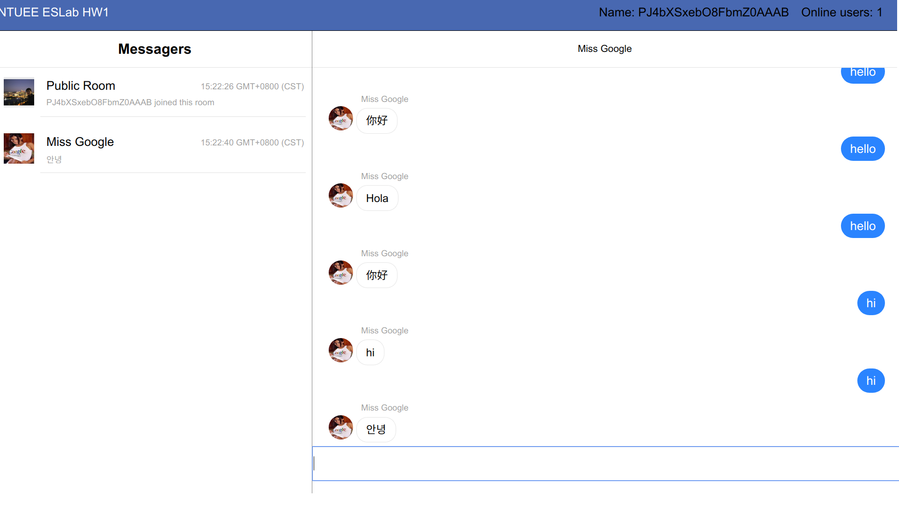
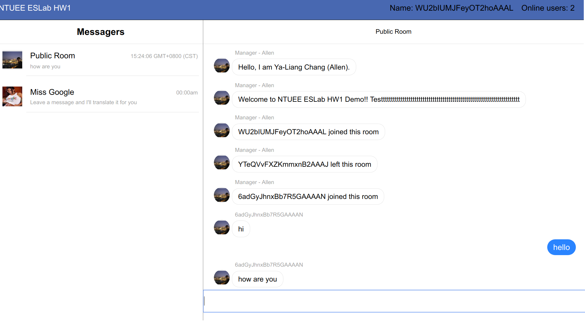

# NTUEE ESLab HW 1




Live demo is deployed on [Heroku](https://b03901014eslabhw1.herokuapp.com/messenger)

## How to run?

``` 
npm install
npm start
```

Go to localhost:5000/messenger and you should see the page as the image above.

In Public Room, you could talk to other users. By clicking their icon, you could have private conversation with them.

Talk to Miss Google and she would translate the message for you.

## Disclaimer

The template is based on [Reactjs - Simple Chat Room](https://github.com/neighborhood999/reactjs-chatroom-example).

## Authors

Ya-Liang Chang (Allen) - [amjtlc295](https://github.com/amjltc295)

